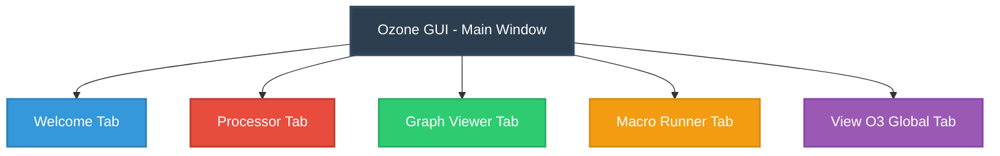
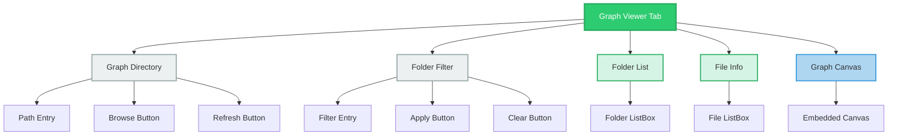
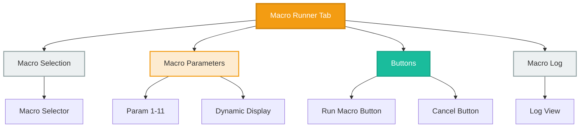
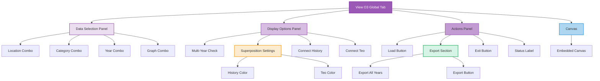
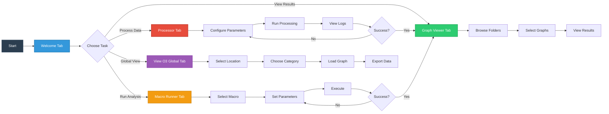
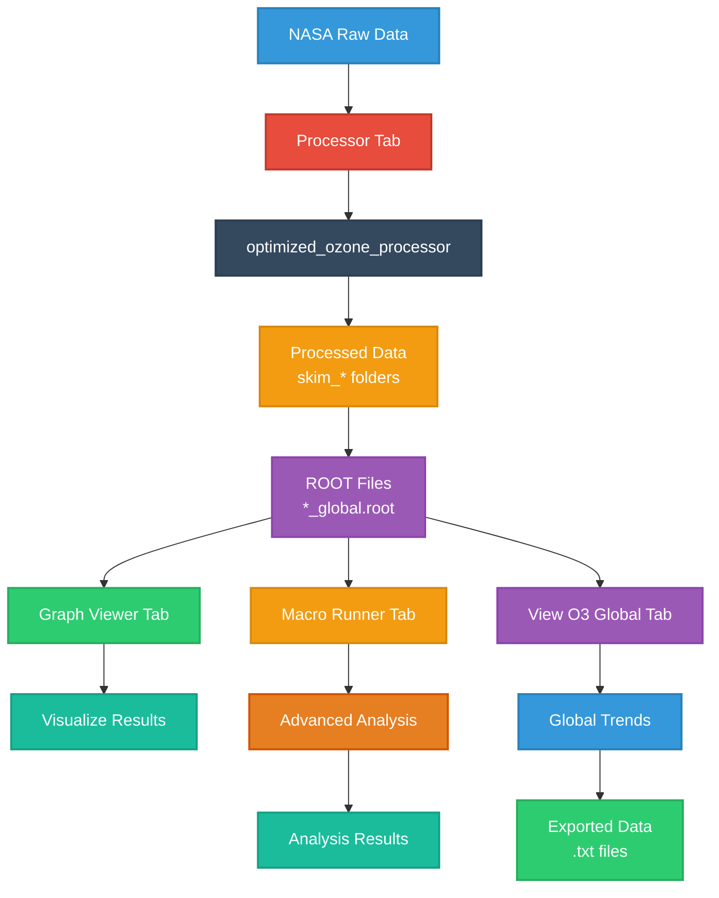
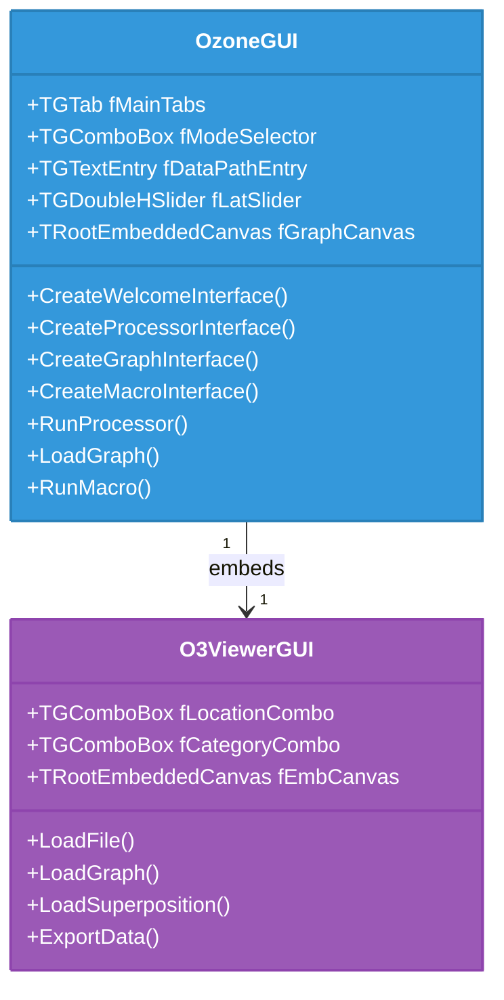

# Ozone GUI - Mermaid Diagrams

## Tab Structure Overview

## Processor Tab Component Hierarchy

```mermaid
graph TB
    PT[Processor Tab] --> MG[Mode Group]
    PT --> LG[Location Group]
    PT --> DP[Data Path Group]
    PT --> LR[Latitude Range]
    PT --> PG[Parameters Group]
    PT --> PO[Performance Options]
    PT --> BT[Buttons]
    PT --> PL[Process Log]

    MG --> MS[Mode Selector]
    LG --> LE[Location Entry]
    DP --> DPE[Path Entry]
    DP --> BB[Browse Button]
    LR --> LS[Lat Slider]
    LR --> LMN[Min Label]
    LR --> LMX[Max Label]
    PG --> PGR[Grid Param]
    PG --> PE[Events Param]
    PG --> PTH[Threads Param]
    PO --> SM[Silent Mode]
    PO --> NB[Notifications]
    BT --> RB[Run Button]
    BT --> CB[Cancel Button]
    PL --> LV[Log View]

    style PT fill:#e74c3c,stroke:#c0392b,stroke-width:3px,color:#fff
    style MG fill:#ecf0f1,stroke:#95a5a6,stroke-width:2px
    style LG fill:#ecf0f1,stroke:#95a5a6,stroke-width:2px
    style DP fill:#ecf0f1,stroke:#95a5a6,stroke-width:2px
    style LR fill:#ecf0f1,stroke:#95a5a6,stroke-width:2px
    style PG fill:#ecf0f1,stroke:#95a5a6,stroke-width:2px
    style PO fill:#ecf0f1,stroke:#95a5a6,stroke-width:2px
    style BT fill:#1abc9c,stroke:#16a085,stroke-width:2px,color:#fff
    style PL fill:#ecf0f1,stroke:#95a5a6,stroke-width:2px
```

## Graph Viewer Tab Component Hierarchy

## Macro Runner Tab Component Hierarchy

## View O3 Global Tab - Three Panel Layout

## User Workflow

## Data Flow Diagram

## Class Diagram

---

## How to View

1. **GitHub/GitLab**: Push this file to your repository - diagrams render automatically
2. **VS Code**: Install "Markdown Preview Mermaid Support" extension
3. **Online**: Copy and paste to https://mermaid.live/
4. **Documentation Tools**: Supports MkDocs, Sphinx, Docusaurus, etc.

## Color Legend

- 🔵 **Blue** (#3498db): Welcome/Information
- 🔴 **Red** (#e74c3c): Processor/Processing
- 🟢 **Green** (#2ecc71): Graph Viewer/Visualization
- 🟠 **Orange** (#f39c12): Macro Runner/Analysis
- 🟣 **Purple** (#9b59b6): View O3 Global/Data
- 🔘 **Gray** (#ecf0f1): UI Components/Groups
- 💚 **Teal** (#1abc9c): Action Buttons
